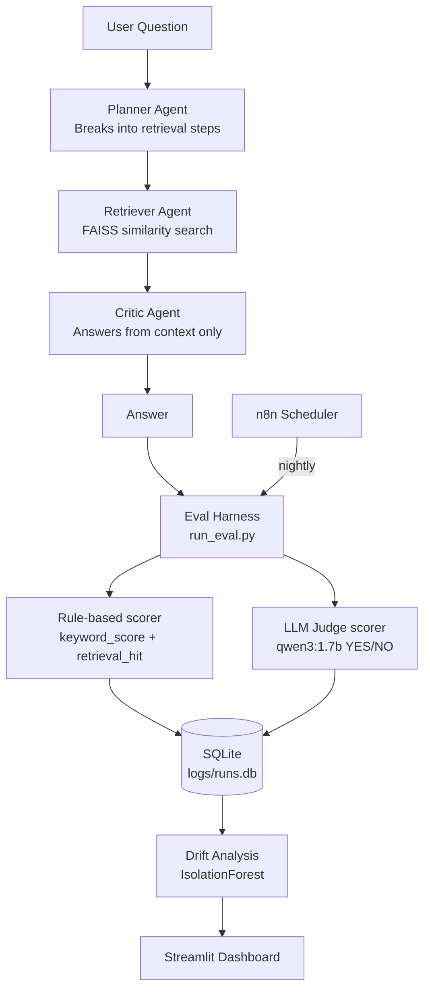

# Agent Auditor — Data-Centric Evaluation Framework for Multi-Agent LLM Pipelines

A data-centric evaluation framework for multi-agent LLM pipelines built with LangGraph.
The core value is the evaluation harness that measures agent reliability, hybrid rule+judge
scoring, and behavioral drift across dataset and prompt versions.

> "I built an agent evaluation framework that quantifies agent reliability and failure modes"
> — not just another agent project.

---

## Architecture



---

## Team

| Member | Role |
|--------|------|
| Member A (Praih Alias Faiza) | Agent pipeline, FastAPI, Docker, cloud deployment |
| Member B (Ayesha) | Eval dataset, scoring, dashboard, n8n automation |

---

## Hardware Benchmarks

Both members benchmarked their machines before committing to a model.
These numbers informed the decision to use `qwen3:1.7b` for all pipeline
and judge calls (faster on CPU than phi4-mini).

| Machine | Model | tok/s |
|---------|-------|-------|
| Member A — Intel Core i5-8300H @ 2.30GHz, 16GB RAM | qwen3:1.7b | 13.65 |
| Member A | phi4-mini | 8.83 |
| Member B — Intel Core i7-6600U @ 2.60GHz, 8GB RAM | qwen3:1.7b | 11.01 |
| Member B | phi4-mini | 4.85 |

**Decision:** All models locked to `qwen3:1.7b` for consistency across both machines.
`nomic-embed-text` used for FAISS embeddings (dedicated embedding model).

---

## Tech Stack

| Component | Technology |
|-----------|-----------|
| Agent orchestration | LangGraph + LangChain |
| Model inference | Ollama (qwen3:1.7b, nomic-embed-text) |
| Vector store | FAISS CPU |
| API | FastAPI + Uvicorn |
| Eval/analysis | scikit-learn, pandas, SQLite |
| Dashboard | Streamlit |
| Automation | n8n (nightly eval scheduler) |
| Deployment | Docker + docker-compose, ngrok public URL |
| Version control | Git — main/dev/feature branches, PR-based merges |

---

## Setup

### Prerequisites
- Python 3.11+
- Ollama installed — https://ollama.com
- 8GB RAM minimum, 16GB recommended
- Git

### Local setup

```bash
# Clone and install
git clone https://github.com/ayyesha12/agentic-auditor.git
cd agentic-auditor
python -m venv .venv

# Activate (Windows)
.venv\Scripts\Activate.ps1

# Install dependencies
pip install -r requirements.txt

# Pull models
ollama pull qwen3:1.7b
ollama pull nomic-embed-text

# Build the FAISS index (run once)
python eval/build_index.py

# Start the API
uvicorn api.main:app --reload --port 8000

# In a second terminal, start the dashboard
streamlit run dashboard/app.py

# Run an eval
python -m eval.run_eval --version v1
```

### Docker setup

```bash
docker compose up --build
# API: http://localhost:8000
# Dashboard: http://localhost:8501
```

---

## Evaluation Methodology

### Dataset
- 20 hand-verified Q&A pairs, manually checked against the fixed 20-document corpus
- Never auto-generated — all `expected_keywords` confirmed to exist literally in source documents
- Corpus: 20 Wikipedia articles about famous scientists
- Covers: simple factual lookups, phrase-level answers, expected INSUFFICIENT CONTEXT cases

### Hybrid scoring

Scoring runs in two stages to balance speed, reliability, and coverage:

**Stage 1 — Rule-based (always runs first):**
`keyword_score()` checks if any expected keyword appears in the answer.
`retrieval_hit()` checks if the correct source document was retrieved.
These are deterministic and fast — no LLM needed.

**Stage 2 — LLM-judge (only when rule-based fails):**
`qwen3:1.7b` evaluates whether the answer is correct and grounded in
the retrieved context. Called only on items that fail rule-based scoring,
to save time and limit noise.

**Both scores are logged separately.** `rule_pass` and `judge_pass` are
never merged into one score. Their disagreement rate is itself a reported
metric, acknowledging the known limitation of a small model judging
another small model's output.

### Data-centric experiment results

| Version | Prompt change | Rule % | Judge % | Finding |
|---------|--------------|--------|---------|---------|
| v1 | Baseline — no few-shot examples | 65.0% | 90.0% | Baseline |
| v2 | Concise few-shot examples in Planner | 60.0% | 85.0% | Worse than baseline |

**Key finding:** Adding few-shot examples to `qwen3:1.7b` degraded performance
by 5 percentage points. This reveals that small models (1.7B parameters) have
limited instruction-following capacity — verbose prompts dilute attention away
from the actual task. This is consistent with known small-model behaviour in
the ML literature.

### Drift detection

`IsolationForest` (`contamination=0.1`) over `latency_seconds`, `rule_pass`,
`judge_pass`, `retrieval_hit` per run. Flags runs that behave unusually.
Output: `logs/drift_report.csv`. Surfaced in the Streamlit dashboard.

---

## API Endpoints

| Method | Endpoint | Description |
|--------|----------|-------------|
| GET | `/health` | Confirms API and graph are loaded |
| GET | `/docs` | Auto-generated Swagger UI for testing |
| POST | `/ask` | Runs a question through the 3-agent pipeline |
| POST | `/run-eval` | Triggers a full eval batch |

### Example

```bash
curl -X POST http://localhost:8000/ask \
  -H "Content-Type: application/json" \
  -d '{"question": "Where was Galileo Galilei born?"}'
```

Response:
```json
{
  "question": "Where was Galileo Galilei born?",
  "answer": "Galileo Galilei was born in Pisa, Italy.",
  "plan": ["Galileo Galilei birthplace Pisa", "Galileo Galilei birthplace Italy"],
  "retrieved_docs": ["..."]
}
```

---

## Project Structure

```
agentic-auditor/
├── agents/
│   ├── state.py          # Shared TypedDict state between agents
│   ├── planner.py        # Breaks question into retrieval steps
│   ├── retriever.py      # FAISS similarity search
│   ├── critic.py         # Answers from context only
│   └── graph.py          # Wires 3 nodes into LangGraph pipeline
├── eval/
│   ├── dataset.json      # 50 Q&A pairs (full set)
│   ├── dataset_small.json # 20 Q&A pairs (used for eval runs)
│   ├── build_index.py    # Builds FAISS index from corpus
│   ├── run_eval.py       # Main eval loop
│   ├── scorer_rules.py   # Rule-based scoring functions
│   ├── scorer_judge.py   # LLM-judge scoring function
│   └── drift_analysis.py # IsolationForest anomaly detection
├── api/
│   └── main.py           # FastAPI app
├── dashboard/
│   └── app.py            # Streamlit eval dashboard
├── data/
│   └── corpus/           # 20 Wikipedia articles (.txt)
├── logs/
│   └── runs.db           # SQLite eval run logs (gitignored)
├── notebooks/
│   ├── experiment_results.md  # Full v1 vs v2 analysis
│   ├── analyze_results.py     # Per-version failure analysis
│   └── compare_versions.py    # Version comparison script
├── n8n/
│   └── workflow.json     # Nightly eval automation
├── Dockerfile.api
├── Dockerfile.dashboard
├── docker-compose.yml
├── requirements.txt
└── SCOPE.md
```

---

## Known Limitations (honest — not excuses)

- **CPU-only inference:** 15–25 tok/s on `qwen3:1.7b`. Eval batches limited
  to 20 items due to thermal constraints on dev machines. Running statistically
  significant trials would require GPU inference or cloud compute.

- **Small model judge:** `qwen3:1.7b` judges its own pipeline's outputs.
  This is a known methodological weakness — mitigated by running rule-based
  scoring first and only calling the judge on ambiguous cases. Judge-rule
  disagreement rate is logged and reported as its own metric.

- **Fixed 20-document corpus:** Findings are specific to this corpus and
  domain. Results do not generalise to open-domain or multi-domain QA.

- **Small eval set (20 items):** Statistical power is limited. A 5%
  difference represents just 1 item. Results should be interpreted as
  directional, not definitive.

- **ngrok deployment:** Public URL regenerates each session on the free tier.
  AWS EC2 deployment configured and pending account activation for a
  persistent URL.

---

## Future Work

- GPU-accelerated inference for larger eval sets (500+ items)
- Replace LLM-judge with a fine-tuned evaluation model
- Extend corpus to multiple domains to test generalisation
- Human-in-the-loop review of anomalous runs flagged by drift detector
- Continuous eval with dataset versioning (DVC)
- Fixed public URL via cloud VM once AWS account activates

---

## Resume Line

> "Built a multi-agent evaluation framework using LangGraph and hybrid
> (rule-based + LLM-judge) scoring to detect behavioral drift and quantify
> reliability across prompt versions; data-centric experiment revealed that
> few-shot prompt curation degrades performance on 1.7B parameter models —
> a finding consistent with known small-model instruction-following limitations.
> Deployed on public HTTPS URL with nightly automated evaluation via n8n."